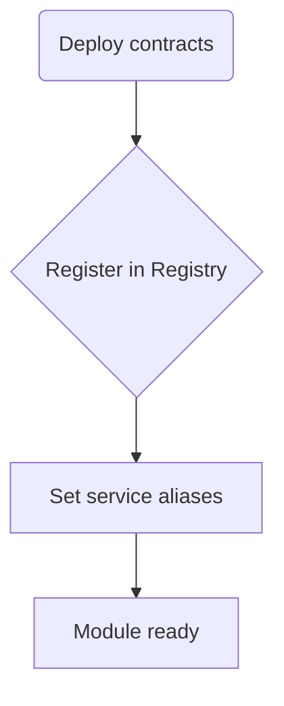

# evmcontest
[](https://github.com/vitekes/evmcontest/actions/workflows/ci.yml)

**A platform for organizing prize contests on EVM networks**

## What is evmcontest?

**evmcontest** is a suite of smart contracts and utilities designed for rapid and secure integration of contest mechanics into any Ethereum Virtual Machine (EVM)–based decentralized project.

### Why use it?

- **Development speed**: Get a ready-made contest factory and escrow contracts instead of rolling your own logic.
- **Security**: Auditable modular contracts based on best practices.
- **Flexibility**: Configurable prize distribution templates, support for ERC-20 and ETH, extendable for NFTs and other assets.

### Use cases

- Organizing bounty programs
- Hosting tournaments and competitions with prize pools
- Decentralized auctions and gamification
- Any scenario requiring guaranteed custody and distribution of prizes

## Key features

- **ContestFactory** — create and manage contests
- **ContestEscrow** — isolated escrow for prize funds and winner distribution
- **NetworkFeeManager** — configure and collect platform fees
- **TokenValidator** — allowlist/blocklist ERC-20 tokens
- **PrizeTemplates** & **PrizeManager** — built-in distribution templates and NFT prize support
- **CreatorBadges** — award badges to contest organizers

## Quick Start

1. Ensure you are using **Node.js 20** (for example via `nvm use 20`) and install dependencies (including Hardhat and `@nomicfoundation/hardhat-toolbox`):

   ```bash
   git clone https://github.com/vitekes/evmcontest.git
   cd evmcontest
   npm install
   ```
2. Create a `.env` file:
   ```env
   PRIVATE_KEY=your_private_key
   RPC_URL=https://...
   ```
3. Launch a local network and deploy:
   ```bash
   npx hardhat node
   npm run deploy:local
   ```
4. Run tests:
   ```bash
   npm test
   ```
   (Do not use `npx test` — it installs an unrelated package.)

5. Run the showcase script to see a complete contest flow:
   ```bash
   npx hardhat run scripts/showcase.ts --network localhost
   ```

## Как запустить Foundry

1. Установите инструментарий Foundry:
   ```bash
   curl -L https://foundry.paradigm.xyz | bash
   foundryup
   ```
2. Запустите тесты:
   ```bash
   forge test
   ```

## Documentation

For detailed information, see:

- **Architecture**: `docs/architecture.md`
- **API**: `docs/api/`
- **Examples**: `docs/examples.md`
- **Testing**: `docs/testing.md`
- **Migrations & Deployment**: `docs/migrations.md`
- **CHANGELOG**: `CHANGELOG.md`

## Deployment notes

After deploying the core `PaymentGateway` contract, make sure to register it in the `Registry` for each module:

```solidity
registry.setModuleServiceAlias(MODULE_ID, "PaymentGateway", gatewayAddress);
```

Without this step modules won't be able to discover the gateway service.

## Как добавить модуль

1. Создайте смарт‑контракты модуля и необходимые сервисы.
2. Задеплойте их в сеть и получите `moduleId`.
3. Зарегистрируйте модуль в `Registry`:
   ```solidity
   registry.registerFeature(moduleId, moduleAddress, 1);
   ```
4. Установите алиасы сервисов, например `PaymentGateway`:
   ```solidity
   registry.setModuleServiceAlias(moduleId, "PaymentGateway", gatewayAddress);
   ```



## Contributing & Support

- **GitHub Issues**: [https://github.com/vitekes/evmcontest/issues](https://github.com/vitekes/evmcontest/issues)
- Pull requests are welcome!

## License

MIT License. © 2025 evmcontest team


