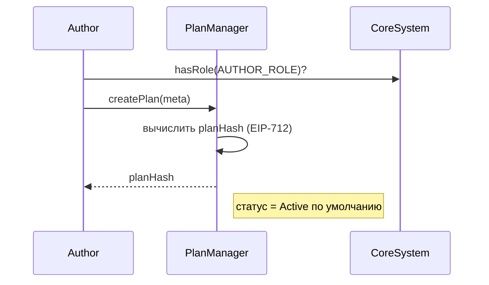

# Архитектурная спецификация: мультиуровневые подписки

## Цели и рамки
- Поддержать несколько тарифных планов (tiers) на автора с ограничением **один активный план на автора для пользователя**.
- Сохранить интеграцию с `PaymentGateway`, Discount/TokenFilter, Permit/Permit2 и off-chain биллингом.
- Обеспечить управление жизненным циклом подписки: создание, автосписание каждые 30 дней, ретрай через 24 часа, ручная активация/деактивация администратора.
- Предоставить фронтенду и бэкенду прозрачный доступ к активным планам и статусам подписок.

## Компоненты и ответственность
- **PlanManager** — новый модуль управления планами.
  - CRUD операций над планами (создание, обновление описания/цены, активация/деактивация).
  - Встроенная проверка прав автора через ACL (`AUTHOR_ROLE` внутри CoreSystem).
  - Хранит метаданные плана и индексирует планы автора.
- **SubscriptionManager v2** — обновлённый контракт подписок.
  - Хранит состояние подписок по ключу `(user, planHash)` и дублирующий индекс `(user, merchant)`.
  - Обрабатывает онбординг, смену плана, отмену, автосписание и ретраи.
  - Эмитирует события для аналитики и интеграции с off-chain.
- **PaymentGateway** — единственная точка списаний и конвертации средств (без изменений по интерфейсу, но расширены события).
- **BillingWorker (off-chain)** — планировщик автосписаний и ретраев; использует новые view-функции `SubscriptionManager`.
- **CoreSystem ACL** — управляет ролями авторов, операторов и автоматизации.

## Модель данных

### План (PlanManager)
| Поле | Тип | Описание |
|------------------------|-------------|--------------------------------------------------------------|
| ytes32 hash | bytes32 | EIP-712 хеш плана (тот же, что подписывается мерчантом). |
| ddress merchant | address | Владетель плана (автор/мерчант). |
| uint128 price | uint128 | Стоимость одного биллингового периода. |
| uint32 period | uint32 | Период списаний в секундах (2592000 = 30 дней). |
| ddress token | address | Токен списаний (ddress(0) — native). |
| PlanStatus status | enum | Inactive, Active, Frozen. План создаётся как Active. |
| uint48 createdAt | uint48 | Время создания плана. |
| uint48 updatedAt | uint48 | Время последнего изменения статуса/URI. |
| string uri | string | Off-chain описание (IPFS/HTTPS). |

Индексы:
- plans[planHash] -> PlanData.
- merchantPlanHistory[merchant] — история всех созданных планов мерчанта.
- ctivePlans[merchant] — список активных planHash (используется UI и SubscriptionManager).
- ctivePlanIndexes[merchant][planHash] — индекс в ctivePlans (index + 1) для O(1) удаления.
### Подписка (`SubscriptionManager`)
| Поле | Тип | Описание |
|------------------------|-------------|--------------------------------------------------------------|
| `address merchant` | address | Дублирование владельца плана для быстрого доступа. |
| `SubscriptionStatus status` | enum | `None`, `Active`, `Inactive`. Логика ретрая хранится в отдельных полях. |
| `uint40 nextChargeAt` | uint40 | Дата следующего регулярного списания. |
| `uint40 retryAt` | uint40 | Время запланированного ретрая (0, если не требуется). |
| `uint16 retryCount` | uint16 | Количество подряд неудачных попыток (0 или 1). |
| `uint40 lastChargedAt` | uint40 | Последнее успешное списание (0 до первого платежа). |
| `CancelReason cancelReason` | enum | `None`, `User`, `RetryFailed`, `Operator`, `Switch`. |
| `uint40 createdAt` | uint40 | Время первой активации подписки. |

Хранилище и индексы:
- `subscriptionStates[user][planHash] -> SubscriptionState` — основное состояние подписки.
- `activePlanByMerchant[user][merchant] -> bytes32 planHash` — гарантирует один активный план на автора.
- `userPlans[user] -> bytes32[]` — список всех `planHash`, с которыми взаимодействовал пользователь.
- `userPlanIndex[user][planHash] -> uint256` — индекс в `userPlans` (index + 1) для O(1) удаления.
- `nativeDeposits[user] -> uint256` — баланс нативных средств для повторных списаний.
- `batchLimit` — лимит для `chargeBatch` (задаётся `setBatchLimit`).
## ACL и роли
- `FEATURE_OWNER_ROLE` — развёртывание/инициализация модулей.
- `AUTHOR_ROLE` (новый) — выдаётся авторам; разрешает CRUD планов в `PlanManager`.
- `OPERATOR_ROLE` — ручная активация/деактивация подписок (доступ саппорту).
- `AUTOMATION_ROLE` — `PaymentGateway`/батч-воркеры для вызовов `charge`/`chargeBatch`.
- `GOVERNOR_ROLE` — настройка лимитов (`batchLimit`, параметры ретрая).

## Потоки

### Управление планом

- Обновление URI — PlanManager.updatePlanUri(planHash, newUri). Изменение цены/периода требует выпуска нового planHash через createPlan.
- Деактивация — `PlanManager.deactivate(planHash)` → событие `PlanStatusChanged`.
- Заморозка/разморозка — PlanManager.freezePlan(planHash, frozen) → события PlanFrozenToggled, PlanStatusChanged.
- Переактивация — PlanManager.activatePlan (проверяет лимит maxActivePlans), деактивация — PlanManager.deactivatePlan.
- Передача владения — PlanManager.transferPlanOwnership(planHash, newMerchant) (только операторы).

### Подписка / смена плана
```mermaid
sequenceDiagram
    participant User
    participant SubMgr as SubscriptionManager
    participant PlanMgr
    participant Gateway as PaymentGateway
    User->>SubMgr: subscribe(plan, sig, permit)
    SubMgr->>PlanMgr: validatePlan(planHash) & status == Active
    SubMgr->>SubMgr: проверить activePlanByMerchant[user][merchant]
    alt есть активный план
        SubMgr->>SubMgr: deactivate(oldPlanHash, reason=Switch)
    end
    SubMgr->>Gateway: processPayment(...)
    Gateway-->>SubMgr: netAmount
    SubMgr->>SubMgr: записать SubscriptionState (status=Active, nextChargeAt=now+period)
- При оплате native пользователь может отправить `msg.value > plan.price`: остаток сохраняется в `nativeDeposits`, `retryCount` и `retryAt` сбрасываются.
- Для альтернативных токенов вызывается `subscribeWithToken` (через `PaymentGateway` и Permit/Permit2).
```
- Подписка выполняется без депозита; `retryCount` и `retryAt` обнуляются.
- Первое списание происходит сразу (как и сейчас), следующее — через `plan.period`.

### Отмена
- Пользователь вызывает `unsubscribe(planHash)` → статус `Inactive`, поля `retryAt=0`, `activePlanByMerchant` очищается, эмитится `SubscriptionCancelled`.
- Оператор может вызвать `forceCancel(user, merchant, reason)` для ручной деактивации.

### Автосписание и ретрай
- Биллинг-воркер последовательно запрашивает `listUserPlans` + `getSubscriptionByPlan`, проверяет `retryAt/nextChargeAt` и вызывает `charge(address, bytes32)` либо `markFailedCharge`.
- После второго фейла пользователь получает off-chain уведомление; повторная активация — через UI (новая подписка) или оператор вручную.

  - Устанавливает `status = Active`, сбрасывает `retryCount` и `retryAt`, `nextChargeAt` определяется режимом (`ImmediateCharge` или `StartNextPeriod`).
- Оператор (`OPERATOR_ROLE`) вызывает `activateManually(user, planHash)`:
  - Проверяет, что план активен и нет другого активного плана того же мерчанта.
  - Устанавливает `status = Active`, `nextChargeAt = now` или `now + period` (настраивается), `retryCount = 0`.
  - Используется для продления без списания (например, бонус за багфикс).

## События
- `PlanCreated(address indexed merchant, bytes32 indexed planHash, uint256 price, address token, uint32 period, string uri)`
- `PlanStatusChanged(address indexed merchant, bytes32 indexed planHash, PlanStatus status)`
- `PlanFrozenToggled(address indexed operator, bytes32 indexed planHash, bool frozen)`
- `PlanUriUpdated(address indexed merchant, bytes32 indexed planHash, string uri)`
- `PlanOwnershipTransferred(address indexed operator, bytes32 indexed planHash, address oldMerchant, address newMerchant)`
- `MaxActivePlansUpdated(uint8 oldLimit, uint8 newLimit)`
- `SubscriptionActivated(address indexed user, bytes32 indexed planHash, address indexed merchant, uint40 nextChargeAt)`
- `SubscriptionSwitched(address indexed user, bytes32 indexed fromPlan, bytes32 indexed toPlan, address merchant)`
- `SubscriptionCancelled(address indexed user, bytes32 planHash, uint8 reason)`
- `SubscriptionCharged(address indexed user, bytes32 planHash, uint256 amount, uint40 nextChargeAt)`
- `SubscriptionRetryScheduled(address indexed user, bytes32 planHash, uint40 retryAt, uint16 retryCount)`
- `SubscriptionFailedFinal(address indexed user, bytes32 planHash, uint8 reason)`
- `ManualActivation(address indexed operator, address indexed user, bytes32 indexed planHash, uint8 mode)`
- `NativeDepositIncreased(address indexed user, uint256 amount, uint256 newBalance)`
- `NativeDepositWithdrawn(address indexed user, uint256 amount, uint256 newBalance)`
- `ChargeSkipped(address indexed user, bytes32 indexed planHash, uint8 reason)`

## View/API ориентиры
- `getPlan(bytes32 planHash)` — метаданные плана (`PlanData`).
- `planStatus(bytes32 planHash)` — текущий статус (`PlanStatus`).
- `listActivePlans(address merchant)` — активные `planHash` мерчанта (детали по `getPlan`).
- `listMerchantPlans(address merchant)` — вся история `planHash` автора.
- `getSubscription(address user, address merchant)` — агрегат по автору.
- `getSubscriptionByPlan(address user, bytes32 planHash)` — состояние конкретной подписки.
- `listUserPlans(address user)` — массив `planHash`, с которыми взаимодействовал пользователь.
  - Для каждой записи старого `subscribers[user]` вызывается `activateManually(user, planHash, ActivationMode.StartNextPeriod)` от оператора (или миграционный скрипт готовит storage перед апгрейдом).
  - `activePlanByMerchant` заполняется на основе `plans[planHash].merchant`.
  - `nextChargeAt` и `lastChargedAt` копируются из legacy-структуры; `retryAt` и `retryCount` сбрасываются.
## Изменения интеграций
- **PaymentGateway**:
  - Дополнить событие `PaymentAttempt` (успех/ошибка), чтобы off-chain биллинг знал причину фейла.
  - Сохранить существующие хелперы, `SubscriptionManager` остаётся инициатором платежей.
- **Off-chain**:
  - Обновить биллинговые воркеры на использование `listUserPlans` + `getSubscriptionByPlan` для проверки сроков (`scripts/run-billing-worker.ts` пример).
  - Обработку событий `SubscriptionRetryScheduled`/`SubscriptionFailedFinal` использовать для уведомлений: первая неудача → письмо/пуш о ретрае; вторая → деактивация + CTA переподписаться.

## Обратная совместимость
- Существующие подписки мигрируются в режиме оффлайн-скрипта:
  - Для каждого `subscribers[user]` создаётся запись `subscriptions[user][planHash]` со статусом `Active`.
  - `activePlanByMerchant` заполняется на основе `plans[planHash].merchant`.
  - `nextChargeAt` и `lastChargedAt` копируются из `Subscriber`.
- Старые функции (`subscribeWithToken` и т.д.) остаются, но выполняют новый код.
- `batchLimit`, Permit2 и DiscountProcessor используются без изменений.

## Контрольные точки перед реализацией
1. Утвердить структуру `PlanManager` и список событий.
2. Согласовать off-chain стратегию обхода подписок (по списку пользователей или индексу событий).
3. Решить, требуется ли хранить историю смены планов on-chain или достаточно событий.
4. Согласовать значения кодов `cancelReason`.
